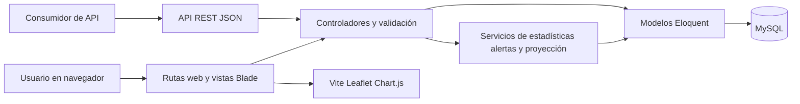
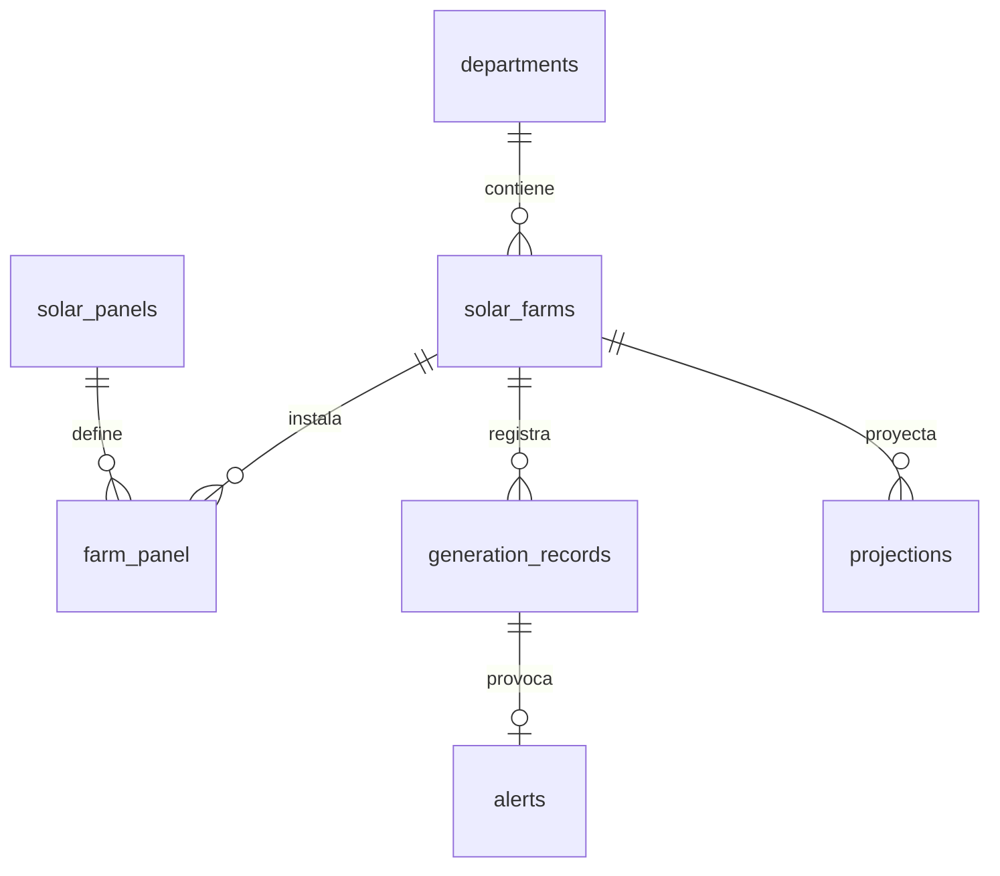

# Arquitectura de Solaris Guatemala

Este documento describe la aplicación ubicada en `solaris/` y sirve como guía de defensa técnica. El estado indicado al final fue verificado contra el código y las pruebas locales.

## Decisión de plataforma

| Capa | Tecnología prevista | Motivo |
|---|---|---|
| Backend | Laravel 12 y PHP 8.2 o superior compatible | Cumplir el framework obligatorio y centralizar validación, relaciones, reglas de negocio y API. |
| Base de datos de entrega | MySQL | Cumplir el motor expresamente aceptado por el reto y usar integridad relacional. |
| Base de pruebas | SQLite | Ejecutar pruebas aisladas y reproducibles; no reemplaza el entregable MySQL. |
| Vistas | Blade | Mantener una aplicación integrada y fácil de explicar y desplegar. |
| Recursos del navegador | Vite | Compilar y versionar estilos y JavaScript. |
| Mapa | Leaflet | Mostrar granjas, selección, información, navegación y zoom. |
| Gráficos | Chart.js | Comparar generación real/esperada, históricos y ranking departamental. |
| Versionado | Git; publicación de código en GitHub | Registrar el desarrollo y proporcionar el enlace solicitado. |

La interfaz presenta información en español y usa kW para potencia, kWh para energía, kg/t para CO₂ y cantidades enteras para paneles/familias. Las cantidades decimales se almacenan con precisión explícita; el formato visual no cambia los valores de cálculo.

## Organización de la aplicación

El navegador usa rutas web de Laravel para formularios y vistas Blade. La API REST expone consultas JSON bajo un prefijo versionado. Ambas entradas comparten los modelos y servicios de dominio para evitar cálculos divergentes.

Los controladores coordinan solicitudes y respuestas. La validación rechaza valores inválidos antes de persistir. Los modelos expresan relaciones. Los servicios calculan capacidad, indicadores, alertas y proyecciones. Los seeders generan datos identificados como demostración, sin presentarlos como mediciones oficiales de Guatemala.

## Contrato de dominio

| Entidad | Tabla prevista | Datos y responsabilidad |
|---|---|---|
| Departamento | `departments` | Catálogo de los 22 departamentos; código/nombre únicos y datos opcionales de referencia geográfica. |
| Modelo de panel | `solar_panels` | Marca, modelo, potencia nominal en kW y estado. |
| Granja solar | `solar_farms` | Nombre, departamento, coordenadas, familias beneficiadas, estado y datos operativos descriptivos. |
| Instalación de paneles | `farm_panel` | Relación granja-modelo de panel y cantidad instalada. |
| Registro de generación | `generation_records` | Granja, período, generación real y esperada en kWh. |
| Alerta | `alerts` | Granja/período o registro asociado; valores real/esperado, desviación y estado si se administra. |
| Proyección | `projections` | Granja, período objetivo, fecha de cálculo, valor previsto y método; datos de comparación cuando existan resultados reales. |

Los nombres finales de columnas pueden ajustarse a las convenciones del código. Las relaciones y reglas deben conservarse.

## Integridad y validación

- Claves foráneas para departamento, granja y panel.
- Potencia de panel positiva; cantidades de paneles enteras positivas cuando se asignan; familias enteras no negativas; generación real/esperada no negativa.
- Coordenadas dentro de rangos geográficos válidos y asociación obligatoria a un departamento del catálogo.
- Un registro de generación por granja y período para prevenir duplicados accidentales.
- Operaciones relacionadas dentro de una transacción cuando una edición actualiza registros y alertas.
- Desactivación de granjas en lugar de borrado que destruya su historia.
- Datos de formularios normalizados y validados también del lado servidor.

El reto no define la granularidad temporal. La implementación debe elegir una periodicidad y conservarla en formularios, consultas, gráficos, API y predicción. También debe documentar si los totales incluyen o excluyen granjas desactivadas.

## Cálculos compartidos

La capacidad instalada se deriva de los paneles: `sum(potencia_kw × cantidad)`. La energía acumulada suma generación real. El CO₂ evitado es `kWh × 0.40 kg/kWh`; las toneladas dividen los kg por 1,000. No se debe multiplicar energía por potencia ni confundir kW con kWh.

Para generación esperada positiva, la desviación es `(esperada − real) / esperada × 100`. Se requiere alerta al cumplir `real <= esperada × 0.80`, incluido el límite exacto. Un esperado cero requiere un tratamiento explícito sin división por cero; no existe desviación porcentual calculable respecto a cero.

Las estadísticas nacionales y departamentales deben agregar sin multiplicar filas al unir instalaciones y registros de generación. Una granja con varios modelos de panel y varios períodos no debe duplicar familias o capacidad.

## Proyecciones y evaluación posterior

El mecanismo debe utilizar únicamente históricos disponibles antes del período objetivo. Puede aplicar un método estadístico explicable, por ejemplo una media móvil de períodos recientes. El método definitivo, ventana y comportamiento con historia insuficiente deben aparecer en la documentación y en la interfaz.

Guardar o reconstruir con corte temporal explícito la predicción permite compararla con la generación real del período objetivo cuando se registre. Recalcular retrospectivamente una predicción con el propio valor real evaluado produciría fuga de información y una comparación engañosa. Si no hay suficientes históricos, mostrar esa condición en lugar de inventar una predicción confiable.

## API prevista

La API debe permitir consultar como mínimo departamentos, granjas, generación y estadísticas. Puede añadir alertas y proyecciones. La documentación final debe reflejar las rutas realmente registradas, parámetros de filtros, paginación, estructura de respuesta y errores de validación; no debe publicar ejemplos de endpoints inexistentes.

La interfaz pública de consulta puede facilitar la evaluación. Cualquier operación de escritura expuesta debe tener una política de acceso explícita; los secretos se gestionan mediante variables de entorno, y los archivos `.env` no se versionan. La configuración de ejemplo utiliza valores de muestra identificables.

## Pruebas y demostración

La cobertura prioritaria es el comportamiento del negocio: límite inclusivo de alerta, cálculo de CO₂ y capacidad, agregación sin duplicados, validación de relaciones/cantidades, consistencia de período y proyecciones sin usar datos futuros. Las consultas de API deben comprobar recursos y filtros reales.

La revisión de navegador debe comprobar los formularios principales, navegación y selección de marcadores, gráficos, errores útiles, pantalla pequeña y escritorio. Los datos demo deben cubrir los 22 departamentos, varios períodos, granjas con rendimiento suficiente e insuficiente y ejemplos con historia para proyección/comparación.

## Despliegue y comprobaciones externas

La entrega requiere servidor Laravel, MySQL, recursos compilados, configuración mediante entorno, migraciones y URL pública con dominio. Un archivo de Docker o una guía de despliegue prepara la entrega, pero no demuestra que la aplicación esté publicada. La comprobación final requiere acceder a la URL real y verificar la API y los datos desde el entorno desplegado.

El GitHub y el dominio deben ser los enlaces reales del proyecto. La documentación de IA debe registrar prompts y herramientas usados, revisión del código y límites observados, sin inventar evidencia ni participación humana.

## Estado verificado antes de la entrega

El 11 de septiembre de 2026 se comprobó la aplicación con MySQL 8.2 local en `127.0.0.1:3308`: 22 departamentos, 32 granjas, 384 registros de generación, 189 proyecciones y 46 alertas. `php artisan test` terminó con 23 pruebas y 231 aserciones; `npm run build` generó los recursos de Vite y las rutas públicas respondieron con HTTP 200. La publicación en la nube y el dominio todavía requieren que el equipo elija proveedor y configure sus credenciales.

## Inspección inicial de MySQL existente

Inspección de solo lectura realizada durante esta sesión:

- El servicio `MySQL80` está en ejecución y escucha en los puertos 3306 y 33060.
- Los servicios `wampmysqld64`, `wampmariadb64` y `wampapache64` están detenidos.
- Existe cliente MySQL en `C:\wamp64\bin\mysql\mysql8.2.0\bin\mysql.exe`; también hay clientes MariaDB en WAMP.
- Una prueba TCP local de lectura con usuario `root`, sin contraseña y sin archivos de configuración, fue rechazada por autenticación. No se pudo verificar la versión del servidor mediante SQL.
- No se consultaron secretos, no se modificaron bases y no se arrancaron ni configuraron servicios.

La inspección confirmó un motor existente con acceso autenticado no resuelto. Ese servicio no se reutilizó ni modificó.

## Instancia MySQL aislada del proyecto

Después de la inspección se preparó una instancia independiente con datos exclusivamente en `C:\Competencia de Progra 2\.local\mysql-data`. Se verificó que el puerto 3308 estuviera libre antes de iniciarla. Se ejecuta como proceso oculto y no como servicio de Windows; la instancia `MySQL80` del puerto 3306 y los servicios WAMP conservaron su estado.

| Parámetro | Valor verificado |
|---|---|
| Motor | MySQL 8.2.0 |
| Interfaz | 127.0.0.1, accesible solamente desde el equipo local |
| Puerto | 3308 |
| Base dedicada | `solaris` |
| Usuario de aplicación | `solaris_app`, permisos sobre `solaris.*` |
| Juego de caracteres | `utf8mb4` |
| Colación | `utf8mb4_unicode_ci` |
| Credenciales locales | `.local/mysql-connection.env`, excluido de Git |
| Inicio local | `.local/start-mysql.ps1` |
| Apagado controlado | `.local/stop-mysql.ps1` |

Las contraseñas de aplicación y administración se generaron con aleatoriedad criptográfica y no se incluyeron en documentación, comandos impresos ni código versionado. Las configuraciones auxiliares con secretos permanecen dentro de `.local`; el SQL temporal de inicialización fue eliminado después de aplicarlo.

Se verificó conexión autenticada, versión, base, puerto, dirección de escucha y juego de caracteres, y se realizó un apagado e inicio limpio. Al terminar la preparación la base estaba vacía y lista para las migraciones de Laravel. Esta preparación no implica publicación en la nube ni certifica por sí misma que todas las pruebas de la aplicación hayan pasado en MySQL.
